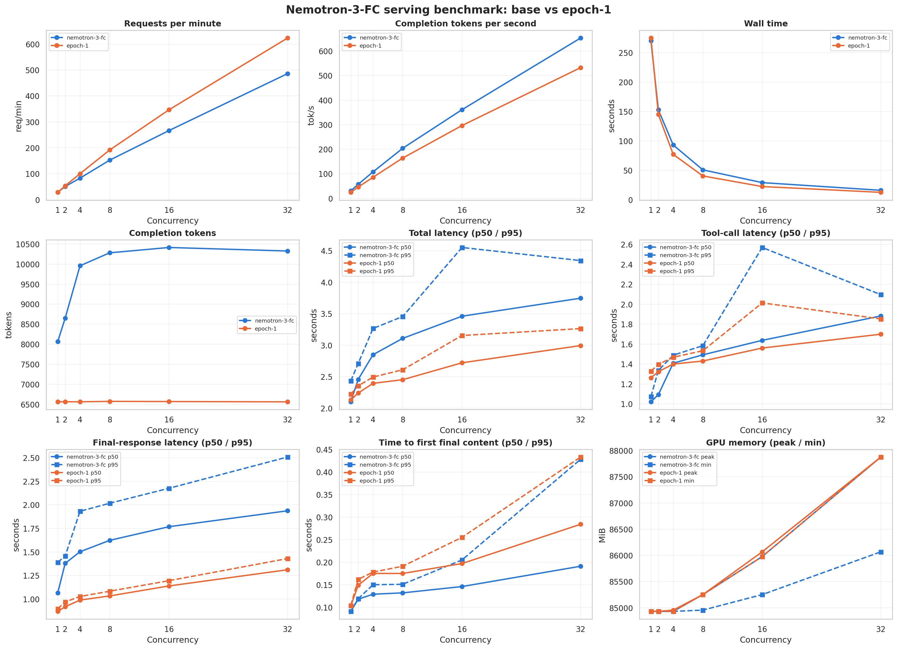

# Serving benchmark

This report records the vLLM serving benchmark for the original Nemotron model
and the same model with the epoch-1 LoRA adapter loaded.

## Workload

- GPU: NVIDIA RTX PRO 6000 Blackwell Server Edition
- Serving runtime: vLLM 0.18.0
- Models: original Nemotron-3-FC and Nemotron-3-FC with the epoch-1 LoRA adapter
- Concurrency levels: 1, 2, 4, 8, 16, and 32
- Interactions per model at each concurrency level: 128
- Total measured interactions: 1,536
- Interaction sequence: user request, generated tool call, deterministic tool result, and streamed final response

## Results

Throughput continued increasing through concurrency 32. The tested range did not
reach a clear saturation point. Epoch-1 completed more full interactions per
minute at higher concurrency, while the original model produced more completion
tokens per second.

Epoch-1 generated substantially fewer completion tokens for the same fixed
workload. Its higher request throughput must therefore be interpreted together
with response length. It does not establish that the adapter has a higher raw
token-generation rate.

Median and p95 interaction latency increased with concurrency but remained
controlled through the maximum tested load. Time to first visible final-response
content remained below half a second across the tested levels.

GPU memory consumption increased with concurrency and reached approximately
85.8 GiB at concurrency 32. The run remained within the available 95.6 GiB.

## Interpretation

The benchmark demonstrates that the repository can serve the base model and the
LoRA adapter through the same OpenAI-compatible vLLM endpoint under concurrent
tool-use workloads. It measures serving behavior, not model quality. BFCL
accuracy and judged correctness belong to the separate evaluation workflow.

The results apply to this hardware, runtime configuration, prompts, response
lengths, and deterministic tool fixture. Requests per minute should not be
compared without also considering completion-token volume and latency.
